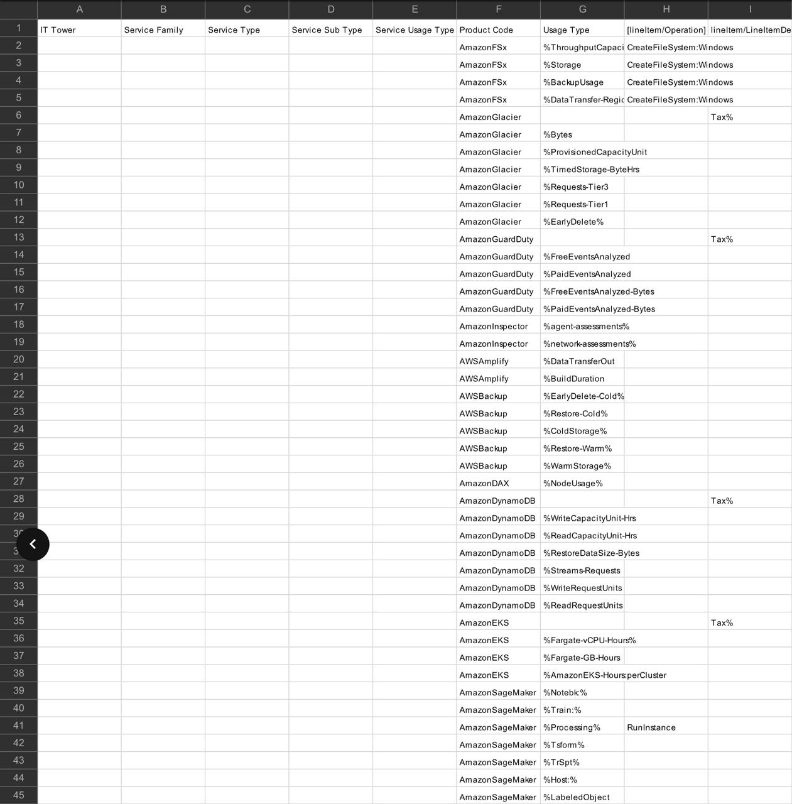
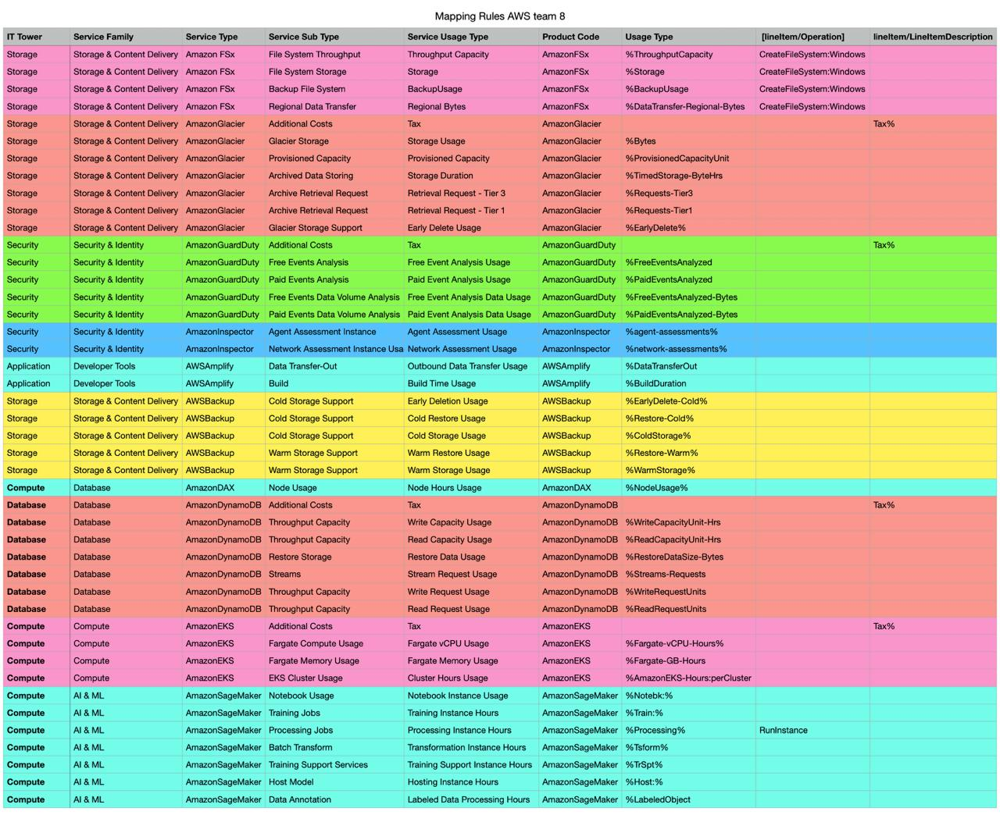

# Лабораторная работа №1: Знакомство с IaaS, PaaS, SaaS сервисами в облаке на примере Amazon Web Services (AWS). Создание сервисной модели. Вариант 8.

## Описание

В этой лабораторной работе мы изучим документацию AWS для анализа данных биллинга. Основная задача — сопоставить параметры из файла с данными использования ресурсов с классификацией сервисов, предоставленной в документации.

## Цель работы

Знакомство с облачными сервисами. Понимание уровней абстракции над инфраструктурой в облаке. Формирование понимания типов потребления сервисов в сервисной-модели. 

## Дано: 

1. Слепок данных биллинга от провайдера после небольшой обработки в виде SQL-параметров. Символ % в начале/конце означает, что перед/после него может стоять любой набор символов.
2. Образец итогового соответствия, что желательно получить в конце. В этом же документе  

## Необходимо: 

1. Импортировать файл .csv в Excel или любую другую программу работы с таблицами. Для Excel делается на вкладке Данные – Из текстового / csv файла – выбрать файл, разделитель – точка с запятой.
2. Распределить потребление сервисов по иерархии, чтобы можно было провести анализ от большего к меньшему (напр. От всех вычислительных ресурсов Compute дойти до конкретного типа использования - Выделенной стойка в датацентре Dedicated host usage).
3. Сохранить файл и залить в соответствующую папку на Google Drive.

---

# Изначальная таблица:

# Заполненная таблица: 

## Описание сервисов: 

| Сервис | Описание |
|----------|----------|
| Amazon FSx | Сервис, который позволяет поднимать готовые файловые системы в AWS |
| AmazonGlacier | Сервис для долгосрочного архивного хранения данных по низкой цене |
| AmazonGuardDuty | Сервис, который анализирует сетевой трафик, CloudTrail и DNS-логи, чтобы выявлять вредоносную активность, подозрительные подключения и потенциальные атаки |
| AmazonInspector | Сервис для автоматического сканирования уязвимостей в EC2, контейнерах (ECR) и Lambda |
| AWSAmplify | Набор инструментов для разработки веб- и мобильных приложений |
| AWSBackup | Унифицированный сервис для централизованного бэкапа ресурсов AWS |
| AmazonDAX | In-memory кэш для ускорения работы DynamoDB |
| AmazonDynamoDB | Управляемая NoSQL база данных |
| AmazonEKS | Управляемый Kubernetes в AWS |
| AmazonSageMaker | Сервис для машинного обучения, который покрывает полный цикл: подготовка данных, обучение моделей, развертывание и мониторинг |

# Вывод

В ходе лабораторной работы я исследовал 10 сервисов AWS. Узнал и заинтересовался AWSAmplify, возможно буду пользоваться им в будущем.
